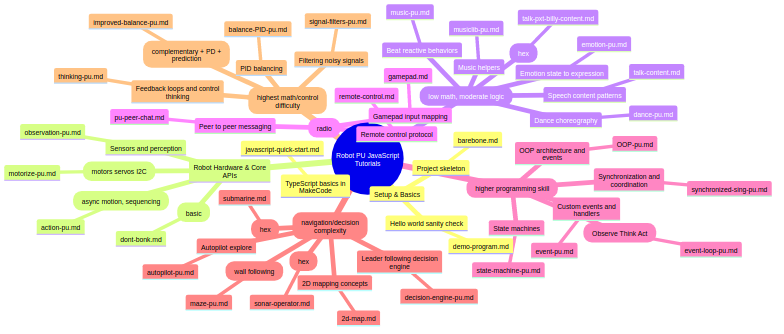
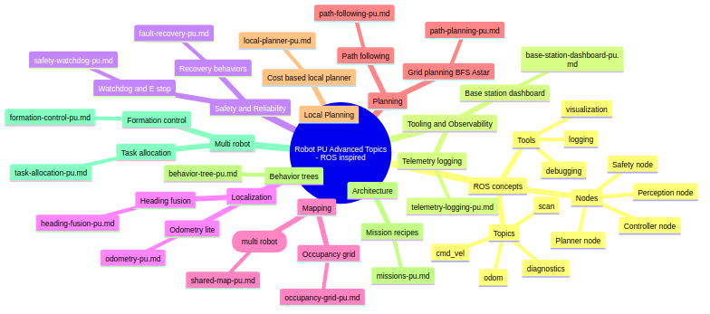

# Robot PU MakeCode Extension

## Overview

Robot PU is a playful, programmable robot built on BBC micro:bit. This extension exposes high‑level behaviors of the PU robot so learners can create interactive projects with block coding or JavaScript/TypeScript in MakeCode. This software package was ported from [Python Version](https://github.com/NovaSeq/RobotPu.git).

PU can walk, autopilot, dance, kick, jump, rest, talk, and sing. It reacts to music, balances using its IMU, and navigates with an ultrasonic sensor.
The retail kit includes a gamepad built from the second micro:bit for radio-based remote control, including gesture head control (tilt to yaw/pitch PU’s head).


Learn more about The Story of PU, which shows robot PU's activities, hardware, software, tutorials, and upgrade projects at:

- **Product Website**: [robotgyms.com/pu](https://robotgyms.com/pu)
- **YouTube**: [The Story of PU](https://www.youtube.com/@TheStoryofPu-yw8tr)
- **TikTok**: [@thestoryofpu](https://www.tiktok.com/@thestoryofpu)
- **Quick Start**： [How to use this library](https://youtu.be/aBw55nYjWDg)

Purchase links:

- **Amazon**: [Robot PU kit](https://www.amazon.com/Robot-Programmable-Interactive-Upgradable-Self-Balancing/dp/B0DR8RGVXN)

## Features

- **Expressive personality**: dance routines, reactions, auto-pilot, soccer
- **Classroom-ready** with block coding, javascript and [Python](https://github.com/NovaSeq/RobotPu.git) paths
- **Maker-friendly** with free tutorials and projects of hardware and software to upgrade robot PU
- **Open-source** with community resources

## What’s in the Kit

- Robot PU (pre-built and upgradable)
- 2 × micro:bit compatible board
- Gamepad (remote control and distributed computation)
- [Manual](https://robotgyms.com/courses/the-story-of-pu-book-1-pair-up/)
- [Tutorials](https://github.com/robotgyms/pxt-robotpu/tree/main/tutorials/README.md)
- [Games](https://robotgyms.com/courses/the-story-of-pu-book-2-games/)
- [Classes](https://robotgyms.com/courses/the-story-of-pu-book-3-growth)
- [Upgrade Projects](https://robotgyms.com/courses/the-story-of-pu-book-4-journey/)
- [Robot PU @ TinkerCAD](https://www.tinkercad.com/joinclass/GVDDWHKQW) 

The retail kit includes a **gamepad that uses the second micro:bit**. For the best experience (and to ensure the radio control protocol matches robotPu’s `runKeyValueCommand` / `runStringCommand`), flash the official Robot PU gamepad program to the gamepad micro:bit:
- https://makecode.microbit.org/_JbygU12aCAsU

## The Story Of Robot PU
- [Return to Saduka](https://robotgyms.com/courses/the-saga-of-robot-pu)

## Activities and Use Cases

- **Little AI friend**: walk, dance, navigate, maze solving, chat, generate songs, sing
- **Games**: soccer, hide-and-seek, group dance/chorus
- 60+ **Learn-then-create** projects: programming, electronics, mechanics, 3D printing accessories
- **Community**: share code and parts, collaborate, coordinate multiple robots

## What’are in the optional parts
- Smart Hat, enable robot PU to see, listen, and do SLAM navigation

- [AI Camera](https://robotgyms.com/courses/the-story-of-pu-book-5-ai-camera)

## What you can learn with Robot PU

Robot PU provides a hands-on learning path from first MakeCode programs to advanced robotics. The tutorials start with blocks and JavaScript/TypeScript basics, then grow into sensing, control, autonomy, mapping, and multi-robot projects.
Python package is at [RobotPu Python](https://github.com/NovaSeq/RobotPu.git).

- **Programming fundamentals**
  - Learn MakeCode blocks, JavaScript/TypeScript, and Python-style robotics workflows.
  - Practice variables, functions, arrays, loops, events, state machines, object-oriented design, and clean project structure.

- **Robot hardware and motion**
  - Understand how servos, motors, I2C devices, micro:bit pins, and action APIs work together.
  - Program walking, turning, side stepping, jumping, kicking, dancing, and asynchronous motion sequences.

- **Sensors, perception, and signal processing**
  - Use sonar, IMU/body tilt, microphone/music input, radio messages, and optional AI camera perception.
  - Filter noisy signals and turn observations into reliable robot decisions.

- **Control theory, balance, and kinematics**
  - Explore feedback control, feedforward ideas, PID/PD control, complementary filtering, prediction, and balance.
  - Connect math concepts to real robot motion, pose, heading, and stability.

- **Navigation, mapping, and SLAM (Simultaneous Localization and Mapping) concepts**
  - Build obstacle avoidance, maze solving, autopilot exploration, odometry-lite pose estimation, heading fusion, 2D maps, occupancy grids, path planning, path following, and local planners.
  - Use Robot PU location data as an entry point to SLAM-style robot navigation.

- ** Learn AI **
  - Use AI to generate songs and sing them.
  - Use Smart Hat Accessories to do face detection, object tracking, and voice commands.
  
- **Communication and multi-robot systems**
  - Work with radio gamepad control, peer-to-peer chat, synchronized singing, shared maps, task allocation, and formation control.
  - Learn ROS-inspired ideas such as nodes, topics, telemetry, dashboards, diagnostics, safety watchdogs, and recovery behaviors.

- **Creative expression and making**
  - Design behaviors with music, speech, emotion, blinking eyes, body language, choreography, games, and AI-camera interaction.
  - Extend Robot PU with storytelling, classroom activities, 3D design, and 3D-printed upgrades.
  
- **3D Design and 3D Printing**
  - Design and print 3D accessories to upgrade Robot PU.
    - TinkerCAD project: [Robot PU @ TinkerCAD](https://www.tinkercad.com/joinclass/GVDDWHKQW)
      
## Tutorial knowledge graphs (JavaScript)

The JavaScript tutorial set includes **knowledge graphs** (mindmaps) that show how topics connect and suggest a learning path.

- The knowledge graphs are maintained in:
  - `tutorials/README.md`
- They include:
  - a general tutorial mindmap (`mindmap.png` + Mermaid source)
  - an advanced, ROS-inspired mindmap (`advanced-ros-mindmap.png` + Mermaid source)





Use these graphs to:

- pick the next tutorial based on your current programming and math level
- understand dependencies (sensors → filtering → state machines → planning)
- navigate the advanced track (telemetry, safety, localization, mapping, planning, multi-robot)

## Quick Start (with the retail gamepad)

1. Flash your **Robot PU micro:bit** with a MakeCode project that uses this test program.
   - https://makecode.microbit.org/_0pKUH5JvWbVL
2. Flash your **gamepad micro:bit** with the official Robot PU gamepad program:
   - https://makecode.microbit.org/S34024-98531-58275-59424
3. Default Gamepad control:
   - PushJoystick: walk (move, turn, side step)
   - Press joystick down: rest
   - Press button B1: autopilot
   - Press button B2: jump
   - Press button B3: soccer kick
   - Press button B4: dance
   - In walk mode, pitch gamepad up/down: head move up/down
   - In walk mode, roll gamepad left/right: head move left/right
4. Ensure both micro:bits use the same radio channel (group):
   - Use `robotPu.setChannel(...)` in your Robot PU project, or set the same `radio.setGroup(...)` on both devices.
5. In your Robot PU project, forward radio messages to robotPu (see the Remote Control section for example code).

## Installation

1. In MakeCode, open your micro:bit project.
2. Add extension → Import URL (or local path) → point to this repository.
   - https://github.com/robotgyms/pxt-robotpu
   - or simply enter: robotgyms/pxt-robotpu

## Dependencies

- core, radio, neopixel (from MakeCode)
- Billy voice package: github:adamish/pxt-billy

## Development with Makefile

This repository includes a `Makefile` to wrap common PXT and release commands.

### Build and compile check

Run a full local MakeCode compile check before pushing:

```bash
make build
```

This runs:

```bash
pxt target microbit
pxt install
pxt build
```

You can also use:

```bash
make check
```

`make check` is an alias for `make build`.

### Install or refresh the MakeCode target

If this is a fresh clone, or if PXT says the target is missing, run:

```bash
make target
```

To install or refresh package dependencies from `pxt.json`, run:

```bash
make install
```

### Clean local build output

```bash
make clean
```

This removes the local `built/` directory.

### Release example

To release version `1.0.42`:

```bash
make release VERSION=1.0.42
```

The release target:

1. Runs the build.
2. Updates the `version` key in `pxt.json`.
3. Stages release files.
4. Creates a git commit named `Release 1.0.42` if there are staged changes.
5. Runs `git push`.
6. Creates the local git tag if it does not already exist.
7. Pushes the tag with `git push origin 1.0.42`.

You can also manage tags separately:

```bash
make tag VERSION=1.0.42
make push-tag VERSION=1.0.42
```

Before running a release, make sure your GitHub authentication is configured for pushing to the repository.

## Blocks / API
This extension auto-initializes the robot on the first call to any `robotPu.*` API:

- **Creates** an internal `RobotPu` instance
- **Runs** `calibrate()` once
- **Starts** a background loop that continuously updates sensors and runs the internal behavior state machine

Because of this, there is **no separate `init` block** in the current API.

The MakeCode blocks are defined in `main.ts` under the `robotPu` namespace and are organized into groups:

- **Setup**
- **Sensors**
- **Actuators**
- **Actions**
- **Remote Control**

### Setup

#### `channel(): number`

- **Block**: `channel`
- **What it does**: Returns the current radio group/channel used for communication.
- **Return**: `0 .. 255`

#### `setChannel(channel: number): void`

- **Block**: `set channel to %channel`
- **What it does**: Sets the radio group/channel used for communication.
- **Parameter**:
  - `channel`: `0 .. 255`

#### `changeChannel(delta: number): void`

- **Block**: `change channel by %delta`
- **What it does**: Adjusts the radio group/channel by `delta`.
- **Notes**:
  - Values wrap into `0..255`.

#### `mode(): Mode`

- **Block**: `mode`
- **What it does**: Returns the current robot behavior mode.

#### `setModeVar(mode: Mode): void`

- **Block**: `set mode to %mode`
- **What it does**: Sets the robot behavior mode (state machine mode).

#### `setServoTrim(leftFoot: number, leftLeg: number, rightFoot: number, rightLeg: number, headYaw: number, headPitch: number): void`

- **Block**: `set servo trim left foot %leftFoot left leg %leftLeg right foot %rightFoot right leg %rightLeg head yaw %headYaw head pitch %headPitch`
- **What it does**: Sets persistent trim offsets (in degrees) added to the target servo angles.
- **When to use**: If your robot does not stand level, walks crooked, or the head is not centered.
- **Notes**:
  - Trims are applied immediately and remain active until changed.

#### Servo calibration / trim mode

Use servo calibration / trim mode to align the robot's feet, legs, neck yaw, and head pitch into a neutral standing position.

- **Enter trim mode**: Press the micro:bit logo button.
- **Robot pose**: The robot moves into calibration stand mode so the foot heels can be aligned.
- **Select servo**:
  - Press gamepad `B2` to decrease servo index.
  - Press gamepad `B3` to increase servo index.
  - The selected servo index is shown on the micro:bit display.
- **Adjust trim**:
  - Press gamepad `B1` to move the selected servo one trim step in one direction.
  - Press gamepad `B4` to move the selected servo one trim step in the other direction.
  - Adjust until the robot's feet, legs, neck yaw, and head pitch are in a neutral stand position.
- **Save and exit**: Press the micro:bit logo button again.
- **Saved configuration**:
  - Servo trim values are saved.
  - The current radio channel number is saved.
  - When the robot boots again, it remembers the saved servo trim and radio channel.

The servo index order is:

1. Left foot
2. Left leg
3. Right foot
4. Right leg
5. Head yaw
6. Head pitch

#### `toggleServoTrim(): void`

- **Block**: `toggle servo trim calibration mode`
- **What it does**: Toggles servo trim calibration mode on or off. Use the gamepad to select and adjust each servo while in calibration mode.

#### `saveServoTrimCalibration(): void`

- **Block**: `save servo trim calibration`
- **What it does**: Saves the current servo trim values and radio channel, exits trim calibration mode, and returns to normal operation.

#### `readConfig(): void`

- **Block**: `read config`
- **What it does**: Loads saved robot configuration, including servo trim values and radio channel.

#### `writeConfig(): void`

- **Block**: `write config`
- **What it does**: Saves current robot configuration, including servo trim values and radio channel.

#### `setWalkSpeedRange(min: number, max: number): void`

- **Block**: `set walk speed range min %min max %max`
- **What it does**: Sets the robot's internal maximum speed scalars used by autonomous behaviors and remote control.
- **Parameters**:
  - `min`: backward max speed (typically negative)
  - `max`: forward max speed (typically positive)
- **Notes**:
  - This affects `explore()` speed planning and remote-control mapping.

#### `eyeBrightness(): number`

- **Block**: `eye brightness`
- **What it does**: Returns the maximum brightness of Robot PU's eye LEDs.
- **Return**: `0 .. 1`

#### `setEyeBrightness(brightness: number): void`

- **Block**: `set eye brightness to %brightness`
- **What it does**: Sets the maximum brightness of Robot PU's eye LEDs.
- **Parameters**:
  - `brightness`: `0 .. 1`

### Sensors

#### `sonarDistanceCm(): number`

- **Block**: `sonar distance (cm)`
- **What it does**: Returns the current ultrasonic distance reading in centimeters.

#### `frontDistanceArray(): number[]`

- **Block**: `front distance array`
- **What it does**: Returns a 5-element array describing the forward "distance profile" used by explore:
  - `[left, leftFront, front, rightFront, right]`

#### `bodyRoll(): number`

- **Block**: `body roll`
- **What it does**: Returns current body roll estimate.

#### `bodyPitch(): number`

- **Block**: `body pitch`
- **What it does**: Returns current body pitch estimate.

#### `musicTempo(): number`

- **Block**: `music tempo`
- **What it does**: Returns the internal beat tracker tempo estimate.

#### `servoTargets(): number[]`

- **Block**: `servo targets`
- **What it does**: Returns the servo target angles array. Items: left foot, left leg, right foot, right leg, head yaw, head pitch, left shoulder, left arm, right shoulder, right arm.

#### `servoControls(): number[]`

- **Block**: `servo controls`
- **What it does**: Returns the servo control output angles array. Items: left foot, left leg, right foot, right leg, head yaw, head pitch, left shoulder, left arm, right shoulder, right arm.

#### `servoTrims(): number[]`

- **Block**: `servo trims`
- **What it does**: Returns the servo trim offsets array. Items: left foot, left leg, right foot, right leg, head yaw, head pitch, left shoulder, left arm, right shoulder, right arm.

#### `resetOdom(): void`

- **Block**: `reset robot location`
- **What it does**: Resets the odometry so Robot PU's position is (0, 0) and heading is 0 degrees (north).

#### `locationArray(): number[]`

- **Block**: `robot location array`
- **What it does**: Returns Robot PU's estimated location as `[x, y, heading]`. x and y are in millimeters, heading is in degrees.

### Actuators

#### `servo(joint: ServoJoint, angle: number): void`

- **Block**: `move %joint servo to %angle`
- **Parameters**:
  - `joint`: one of the `ServoJoint` values
  - `angle`: `0 .. 180`
- **What it does**: Directly moves a selected joint servo to the given angle.

#### `servoStep(joint: ServoJoint, target: number, stepSize: number): void`

- **Block**: `move %joint servo to %target with step size %stepSize`
- **Parameters**:
  - `target`: `0 .. 180`
  - `stepSize`: `1 .. 20`
- **What it does**: Moves a servo toward a target using progressive stepping (useful for smoother gestures).

#### `servoStepStatus(joint: ServoJoint, target: number, stepSize: number): number`

- **Block**: `servo step %joint to %target step size %stepSize`
- **Parameters**:
  - `target`: `0 .. 180`
  - `stepSize`: `1 .. 20`
- **What it does**: Moves a servo toward a target using progressive stepping and returns `1` while moving, `0` when arrived.

#### `moveServos(targets: number[], speeds: number[], syncList: number[], syncSpeedGain: number, asyncList: number[], asyncSpeedGain: number): boolean`

- **Block**: `move servos targets %targets speeds %speeds synchronous indexes %syncList synchronous gain %syncSpeedGain asynchronous indexes %asyncList asynchronous gain %asyncSpeedGain`
- **What it does**: Moves multiple servos toward target angles simultaneously, with separate synchronous and asynchronous servo groups.
- **Parameters**:
  - `targets`: array of 10 target angles (0 to 180)
  - `speeds`: array of 10 maximum step sizes
  - `syncList`: array of servo joint indices that must arrive before returning
  - `syncSpeedGain`: speed multiplier for the synchronous group
  - `asyncList`: array of servo joint indices that move in the background
  - `asyncSpeedGain`: speed multiplier for the asynchronous group
- **Return**: `boolean` true when the synchronous servos have arrived

#### `setCt(indexes: number[], values: number[]): void`

- **Block**: `set control offsets indexes %indexes values %values`
- **What it does**: Sets servo control offsets for feedback or feedforward control. Each value is an angle offset added to the servo motion target.

#### `incrCt(indexes: number[], values: number[], gain: number): void`

- **Block**: `increment control offsets indexes %indexes values %values gain %gain`
- **What it does**: Increments servo control offsets smoothly. Each value is multiplied by gain and added to the current offset.

#### `leftEyeBright(brightness: number): void`

- **Block**: `set left eye brightness %brightness`
- **Parameters**:
  - `brightness`: `0 .. 1`
- **What it does**: Sets left eye LED brightness.

#### `rightEyeBright(brightness: number): void`

- **Block**: `set right eye brightness %brightness`
- **Parameters**:
  - `brightness`: `0 .. 1`
- **What it does**: Sets right eye LED brightness.

### Actions

#### `setMode(mode: Mode): void`

- **Block**: `set mode %mode`
- **What it does**: Sets Robot PU's behavior mode directly.

#### `greet(): void`

- **Block**: `greet`
- **What it does**: Speaks an introduction using Billy voice (includes the robot serial string and name).
- **Return**: `void`

#### `sonarScan(): void`

- **Block**: `sonar scan`
- **What it does**: Takes one sonar reading and updates the internal front distance array. Call this before reading the front distance array.

#### `playToneSequenceMs(frequencies: number[], durations: number[]): void`

- **Block**: `play tones frequencies %frequencies durations (ms) %durations`
- **What it does**: Plays a sequence of tones using arrays of frequencies in Hz and durations in milliseconds. Use frequency `0` for a rest.

#### `walk(speed: number, turn: number): number`

- **Block**: `walk speed %speed turn %turn`
- **Parameters**:
  - `speed`: `-5 .. 5`
    - Positive = forward
    - Negative = backward
  - `turn`: `-1 .. 1`
    - `-1` = hard left
    - `0` = straight
    - `1` = hard right
- **What it does**: Executes a self-balancing walking gait using the micro:bit accelerometer.
- **Return**: `number` motion status
  - `1` means the gait step is still in progress
  - `0` means the current step completed (the internal gait state advanced)
- **Notes**:
  - This is designed to be called repeatedly (e.g. inside `basic.forever`).
  - You may use speed higher than 5 to make the robot move faster but the robot will be less stable because it cannot balance well due to the limited sampling rate of IMU and servo action speed.

#### `walkDo(speed: number, turn: number): void`

- **Block**: `walk speed %speed turn %turn` (statement form)
- **What it does**: Same as `walk(...)` but discards the return value.

#### `walkByCompass(headingDeg: number): number`

- **Block**: `walk by compass %headingDeg`
- **What it does**: Walks toward a target compass heading while avoiding obstacles.
- **Parameters**:
  - `headingDeg`: target heading in degrees (0 = north, 90 = east)
- **Return**: `number` motion status

#### `walkByCompassPID(headingDeg: number, kp: number, ki: number, kd: number): number`

- **Block**: `walk by compass PID %headingDeg proportional gain %kp integral gain %ki derivative gain %kd`
- **What it does**: Walks toward a target compass heading using PID control while avoiding obstacles.
- **Parameters**:
  - `headingDeg`: target heading in degrees
  - `kp`: proportional gain
  - `ki`: integral gain
  - `kd`: derivative gain
- **Return**: `number` motion status

#### `explore(): number`

- **Block**: `explore`
- **What it does**: Autonomous obstacle avoidance using the onboard ultrasonic sensor (HCSR04).
  - Samples distance ahead while sweeping and steers toward the most open direction.
  - Internally calls `walk(...)` with computed speed/turn.
- **Return**: `number` motion status (same convention as `walk`)
- **Notes**:
  - The explore speed range is influenced by `setWalkSpeedRange(min, max)`.

#### `exploreDo(): void`

- **Block**: `explore` (statement form)
- **What it does**: Same as `explore()` but discards the return value.

#### `stand(): number`

- **Block**: `stand`
- **What it does**: Moves the robot into a standing pose (balanced / ready).
- **Return**: `number` motion status (same convention as `walk`)

#### `standDo(): void`

- **Block**: `stand` (statement form)
- **What it does**: Same as `stand()` but discards the return value.

#### `sideStep(direction: number): number`

- **Block**: `side step %direction`
- **Parameters**:
  - `direction`: `-1 .. 1` (negative = left, positive = right)
- **What it does**: Performs a sideways step.
- **Return**: `number` motion status

#### `sideStepDo(direction: number): void`

- **Block**: `side step %direction` (statement form)
- **What it does**: Same as `sideStep()` but discards the return value.

#### `dance(): number`

- **Block**: `dance`
- **What it does**: Beat-reactive dancing.
  - Uses `input.soundLevel()` to detect beats and vary movement.
  - Animates the NeoPixel LEDs during high beats.
- **Return**: `number` motion status (same convention as `walk`)

#### `danceDo(): void`

- **Block**: `dance` (statement form)
- **What it does**: Same as `dance()` but discards the return value.

#### `kick(): number`

- **Block**: `kick`
- **What it does**: A quick kick-like burst using an accelerated forward gait.
- **Return**: `number` motion status
  - Returns `0` when the kick completes and the robot transitions back to manual/neutral behavior internally.

#### `kickDo(): void`

- **Block**: `kick` (statement form)
- **What it does**: Same as `kick()` but discards the return value.

#### `jump(): number`

- **Block**: `jump`
- **What it does**: Executes a jump sequence.
  - Uses an auxiliary servo during the sequence.
- **Return**: `number` motion status
  - Returns `0` when the jump completes and the auxiliary servo retracts.

#### `jumpDo(): void`

- **Block**: `jump` (statement form)
- **What it does**: Same as `jump()` but discards the return value.

#### `rest(): number`

- **Block**: `rest`
- **What it does**: Balanced idle / rest pose.
  - Keeps balance using the accelerometer.
  - Reacts to sound level with subtle motion.
- **Return**: `number` motion status (same convention as `walk`)

#### `restDo(): void`

- **Block**: `rest` (statement form)
- **What it does**: Same as `rest()` but discards the return value.

#### `calibrate(): void`

- **Block**: `calibrate`
- **What it does**: Moves to a calibration pose and flashes the eyes.
- **Notes**:
  - Calibration is already run once automatically on first use; call this again if you changed trim or hardware.

#### `talk(text: string): void`

- **Block**: `talk %text`
- **What it does**: Text-to-speech using the Billy voice package.
- **Parameters**:
  - `text`: Text to speak.

#### `sing(s: string): void`

- **Block**: `sing %s`
- **What it does**: Sings a musical note sequence using the built-in music engine.
- **Parameters**:
  - `s`: Note sequence string. Notes are written as letter names (A-G) with optional octave number, separated by spaces. Use `-` for a rest.

#### `morse(code: string, unitMs: number): void`

- **Block**: `morse %code|| speed %unitMs ms`
- **What it does**: Plays a morse code string using ITU-standard timing.

#### `toMorse(text: string): string`

- **Block**: `translate %text to morse`
- **What it does**: Translates plain text into a morse code string.
- **Return**: `string` morse code

#### `morseText(text: string, unitMs: number): void`

- **Block**: `say %text in morse|| speed %unitMs ms`
- **What it does**: Translates plain text to morse code and plays it immediately.

### Remote Control

These APIs are intended for advanced integrations (custom gamepads / phone apps / another micro:bit sending commands).

If you have the retail Robot PU gamepad, use the official gamepad program (it is designed to be compatible with Robot PU's command keys and message formats).

#### Radio control protocol (micro:bit radio, including BLE-to-radio bridges)

Robot PU can be controlled over the micro:bit radio protocol by sending either:

- **Value messages** (recommended for joysticks / continuous control)
  - Send using `radio.sendValue(name, value)`
  - Receive using `radio.onReceivedValue((name, value) => ...)`
  - Forward to robotPu using `robotPu.runKeyValueCommand(name, value)`
- **String messages** (recommended for text, singing, and simple triggers)
  - Send using `radio.sendString(text)`
  - Receive using `radio.onReceivedString((text) => ...)`
  - Forward to robotPu using `robotPu.runStringCommand(text)`

**Important note about `radio.sendValue`**:

- micro:bit radio "value" packets are transmitted as integers.
- For **movement control** (`#puspeed`, `#puturn`), Robot PU expects a value roughly in `-1 .. 1`.
  - If your controller sends a different scale (for example `-100 .. 100`), scale it on the receiver before calling `robotPu.runKeyValueCommand`.
- For **gesture head control** (`#puroll`, `#pupitch`), values are treated as angles (degrees) to yaw/pitch PU's head.

**Channel / pairing**:

- Robot PU uses the micro:bit radio **group** as its channel.
- Use `robotPu.channel()` / `robotPu.setChannel(...)` (or `radio.setGroup(...)` on the sender) so both devices are on the same group (0..255).

**Receiver (Robot PU micro:bit) example**:

```ts
radio.onReceivedValue(function (name, value) {
    robotPu.runKeyValueCommand(name, value)
})
radio.onReceivedString(function (text) {
    robotPu.runStringCommand(text)
})
```

**Sender (gamepad micro:bit) example**:

```ts
// movement (normalized)
radio.sendValue("#puspeed", 1)
radio.sendValue("#puturn", -1)

// gesture remote control (head): send micro:bit roll/pitch as degrees
// Robot PU maps #puroll/#pupitch to head yaw/pitch offsets (smoothed internally)
radio.sendValue("#puroll", input.rotation(Rotation.Roll))
radio.sendValue("#pupitch", input.rotation(Rotation.Pitch))
// text actions
radio.sendString("#putHello!")
```

**Gesture remote control (gamepad)**:

- The retail gamepad program reads the gamepad micro:bit's tilt:
  - **Roll** (left/right tilt) → sends `#puroll`
  - **Pitch** (forward/back tilt) → sends `#pupitch`
- Robot PU uses these values to control its head orientation:
  - `#puroll` controls head **yaw** (left/right)
  - `#pupitch` controls head **pitch** (up/down)
- Values are interpreted as **degrees of offset** and are smoothed internally.
- Recommended range: `-90 .. 90` (values outside this range may saturate at servo limits).

**Custom controller scaling (optional)**:

If your controller sends larger integers for movement (for example `-100 .. 100`), scale them before forwarding:

```ts
radio.onReceivedValue(function (name, value) {
    if (name == "#puspeed" || name == "#puturn") {
        robotPu.runKeyValueCommand(name, value / 100)
    } else {
        robotPu.runKeyValueCommand(name, value)
    }
})
```

If your controller is a phone/app over BLE, the typical architecture is:

- Phone/app (BLE)
- Controller micro:bit receives BLE events and converts them to `radio.sendValue(...)` / `radio.sendString(...)`
- Robot PU micro:bit receives radio and calls `robotPu.runKeyValueCommand(...)` / `robotPu.runStringCommand(...)`

#### `runStringCommand(s: string): void`

- **Block**: `execute command %s`
- **What it does**: Parses and executes a string command.
- **Supported command formats**:
  - `#put<text>`: speak `<text>` (text-to-speech)
  - `#pus<song>`: sing `<song>`
  - `#puhi<name>`: speak "My friend <name> is here"
  - `#pun<sn>`: set the robot serial/name string to `<sn>` and then `greet()`

#### `runKeyValueCommand(key: string, v: number): void`

- **Block**: `execute command key %key value %v`
- **What it does**: Executes a key/value command (mostly used for joystick-style control).
- **Supported keys**:
  - `#puspeed`: forward/back command.
    - Recommended normalized range: `-1 .. 1` (after scaling/normalization)
    - A deadzone of about `±0.2` is applied.
    - Internally scaled by the configured max speeds (see `setWalkSpeedRange(min, max)`).
  - `#puturn`: turn command.
    - Recommended normalized range: `-1 .. 1` (after scaling/normalization)
    - Smoothed internally (low-pass).
  - `#puroll`: roll bias (head/body side tilt).
    - Recommended range: `-90 .. 90`
    - Smoothed internally.
  - `#pupitch`: pitch bias (head/body up/down).
    - Recommended range: `-90 .. 90`
    - Smoothed internally; sign is inverted internally.
  - `#puB`: set internal behavior/state (advanced).
    - Examples: `1` explore, `3` dance, `4` kick, `2` jump.
  - `#pulogo`: speak serial/name (advanced).
  - `#purs`: set rest pose index (advanced).
    - Example: send `26` for the rest pose.

## Example (JavaScript)

```ts
// Initialize robot by ask it to greet
robotPu.greet()

// press button A to walk forward in circles
input.onButtonPressed(Button.A, function () {
    for (let index = 0; index < 400; index++) {
        robotPu.walk(3, -0.5)
    }
})
// logo up to sing
input.onGesture(Gesture.LogoUp, function () {
    robotPu.sing("E D G F B A C5 B ")
})
// tilt left to kick
input.onGesture(Gesture.TiltLeft, function () {
    robotPu.kick()
})
// face down to talk
input.onGesture(Gesture.ScreenDown, function () {
    robotPu.talk("Put me down")
})
// press button A+B to do autopilot
input.onButtonPressed(Button.AB, function () {
    for (let index = 0; index < 4000; index++) {
        robotPu.explore()
    }
})
// Register the event listener for incoming string messages
radio.onReceivedString(function (receivedString) {
    robotPu.runStringCommand(receivedString)
})
// press button B to walk backward in circles
input.onButtonPressed(Button.B, function () {
    for (let index = 0; index < 400; index++) {
        robotPu.walk(-1, -0.5)
    }
})
// tilt right to jump
input.onGesture(Gesture.TiltRight, function () {
    robotPu.jump()
})
// listen to radio messages for commands of key value pairs
radio.onReceivedValue(function (name, value) {
    robotPu.runKeyValueCommand(name, value)
})
// logo down to rest
input.onGesture(Gesture.LogoDown, function () {
    robotPu.rest()
})
// press logo button to dance using set mode
input.onLogoEvent(TouchButtonEvent.Pressed, function () {
    robotPu.setMode(robotPu.Mode.Dance)
})
```

## Tips

- **Speed and turning**: positive speed walks forward, negative walks backward; `turn` is −1 (left) to 1 (right).
- **Explore** uses the onboard ultrasonic sensor (HCSR04) for obstacle avoidance.
- **Voice**: `talk` and `sing` require the Billy voice dependency.

## License

- MIT License. See `LICENSE`.
- Copyright © 2025 Robot Gyms Inc.

## Acknowledgments

- PU robot concept and kit by Robot Gyms. This MakeCode extension wraps the robot behaviors for education and rapid prototyping.
