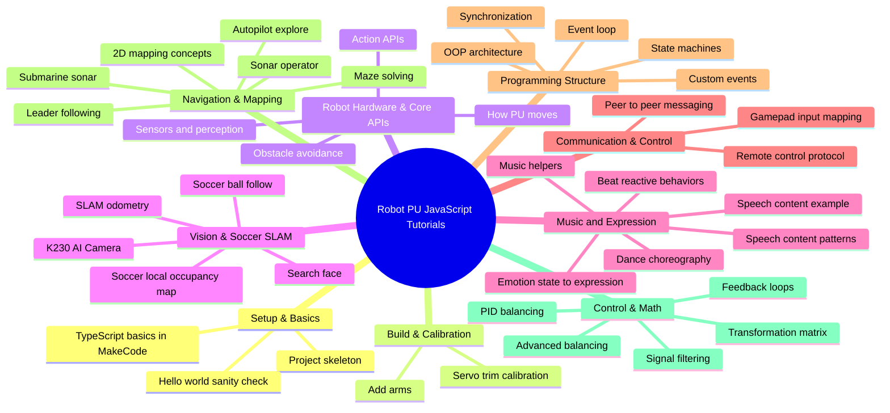
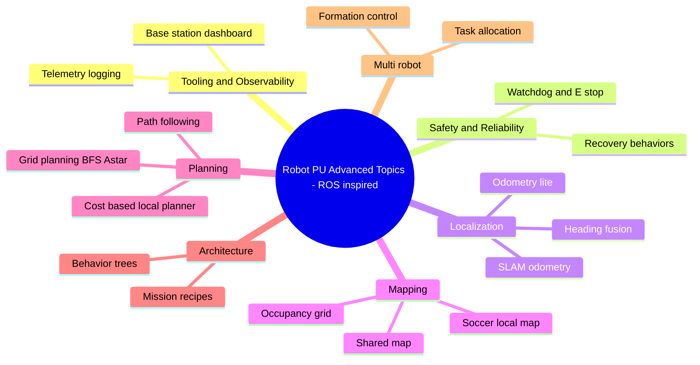

# JavaScript Tutorials (Robot PU)

This folder contains the JavaScript / TypeScript tutorials for the **Robot PU** MakeCode extension.

These lessons are written for the **micro:bit MakeCode editor**:

- **MakeCode editor**: https://makecode.microbit.org
- **GitHub tutorial folder**: https://github.com/robotgyms/pxt-robotpu/tree/main/tutorials/JavaScripts

---

## How to use these tutorials

- **Open MakeCode**: Go to https://makecode.microbit.org.
- **Add Robot PU**: Add the **Robot PU** extension to your MakeCode project.
- **Choose a tutorial**: Click a tutorial link below and copy the TypeScript code into MakeCode when provided.
- **Flash examples**: If a tutorial mentions a `.hex` file, download and flash it to the micro:bit.

---

## Knowledge graph

---

## Advanced ROS topics knowledge graph

---

## Content index

Follow this sequence from beginner to advanced. Each tutorial link points to the GitHub file so students can click directly into the lesson.

### Setup & basics

- **Bare minimum project structure**: [barebone.md](https://github.com/robotgyms/pxt-robotpu/blob/main/tutorials/JavaScripts/barebone.md)
- **A small demo program to verify your setup**: [demo-program.md](https://github.com/robotgyms/pxt-robotpu/blob/main/tutorials/JavaScripts/demo-program.md)
- **JavaScript / TypeScript quick start**: [javascript-quick-start.md](https://github.com/robotgyms/pxt-robotpu/blob/main/tutorials/JavaScripts/javascript-quick-start.md)

### Build, assembly, and calibration

- **Add arms**: [AddArms.md](https://github.com/robotgyms/pxt-robotpu/blob/main/tutorials/JavaScripts/AddArms.md)
- **Servo trim calibration**: [servo-trim-calibration.md](https://github.com/robotgyms/pxt-robotpu/blob/main/tutorials/JavaScripts/servo-trim-calibration.md)

### Robot hardware & core APIs

- **How Robot PU moves**: [motorize-pu.md](https://github.com/robotgyms/pxt-robotpu/blob/main/tutorials/JavaScripts/motorize-pu.md)
- **Robot actions**: [action-pu.md](https://github.com/robotgyms/pxt-robotpu/blob/main/tutorials/JavaScripts/action-pu.md)
- **Robot observation**: [observation-pu.md](https://github.com/robotgyms/pxt-robotpu/blob/main/tutorials/JavaScripts/observation-pu.md)
- **Don’t bonk**: [dont-bonk.md](https://github.com/robotgyms/pxt-robotpu/blob/main/tutorials/JavaScripts/dont-bonk.md)

### Vision, AI camera, and soccer SLAM

- **K230 AI camera**: [K230-AI-Camera-pu.md](https://github.com/robotgyms/pxt-robotpu/blob/main/tutorials/JavaScripts/K230-AI-Camera-pu.md)
- **Search face**: [search-face.md](https://github.com/robotgyms/pxt-robotpu/blob/main/tutorials/JavaScripts/search-face.md)
- **SLAM odometry**: [slam-odometry-pu.md](https://github.com/robotgyms/pxt-robotpu/blob/main/tutorials/JavaScripts/slam-odometry-pu.md)
- **SLAM soccer ball follow**: [slam-soccer-ball-follow.md](https://github.com/robotgyms/pxt-robotpu/blob/main/tutorials/JavaScripts/slam-soccer-ball-follow.md)
- **SLAM soccer local occupancy map**: [slam-soccer-local-map.md](https://github.com/robotgyms/pxt-robotpu/blob/main/tutorials/JavaScripts/slam-soccer-local-map.md)

### Music, speech, and expression

- **Music + beat-driven behaviors**: [music-pu.md](https://github.com/robotgyms/pxt-robotpu/blob/main/tutorials/JavaScripts/music-pu.md)
- **Music library utilities**: [musiclib-pu.md](https://github.com/robotgyms/pxt-robotpu/blob/main/tutorials/JavaScripts/musiclib-pu.md)
- **Dance choreography**: [dance-pu.md](https://github.com/robotgyms/pxt-robotpu/blob/main/tutorials/JavaScripts/dance-pu.md)
- **Emotion state to expression**: [emotion-pu.md](https://github.com/robotgyms/pxt-robotpu/blob/main/tutorials/JavaScripts/emotion-pu.md)
- **Talk content patterns**: [talk-content.md](https://github.com/robotgyms/pxt-robotpu/blob/main/tutorials/JavaScripts/talk-content.md)
- **Talk pxt-billy content**: [talk-pxt-billy-content.md](https://github.com/robotgyms/pxt-robotpu/blob/main/tutorials/JavaScripts/talk-pxt-billy-content.md)

### Communication & control

- **Remote control**: [remote-control.md](https://github.com/robotgyms/pxt-robotpu/blob/main/tutorials/JavaScripts/remote-control.md)
- **Gamepad patterns**: [gamepad.md](https://github.com/robotgyms/pxt-robotpu/blob/main/tutorials/JavaScripts/gamepad.md)
- **Peer chat over radio**: [pu-peer-chat.md](https://github.com/robotgyms/pxt-robotpu/blob/main/tutorials/JavaScripts/pu-peer-chat.md)

### Programming structure

- **Event loop**: [event-loop-pu.md](https://github.com/robotgyms/pxt-robotpu/blob/main/tutorials/JavaScripts/event-loop-pu.md)
- **Custom events and handlers**: [event-pu.md](https://github.com/robotgyms/pxt-robotpu/blob/main/tutorials/JavaScripts/event-pu.md)
- **State machines**: [state-machine-pu.md](https://github.com/robotgyms/pxt-robotpu/blob/main/tutorials/JavaScripts/state-machine-pu.md)
- **Object-oriented programming architecture**: [OOP-pu.md](https://github.com/robotgyms/pxt-robotpu/blob/main/tutorials/JavaScripts/OOP-pu.md)
- **Synchronized singing**: [synchronized-sing-pu.md](https://github.com/robotgyms/pxt-robotpu/blob/main/tutorials/JavaScripts/synchronized-sing-pu.md)

### Navigation, autonomy, and mapping

- **Submarine sonar complete project**: [submarine.md](https://github.com/robotgyms/pxt-robotpu/blob/main/tutorials/JavaScripts/submarine.md)
- **Sonar operator**: [sonar-operator.md](https://github.com/robotgyms/pxt-robotpu/blob/main/tutorials/JavaScripts/sonar-operator.md)
- **Maze solving**: [maze-pu.md](https://github.com/robotgyms/pxt-robotpu/blob/main/tutorials/JavaScripts/maze-pu.md)
- **Autopilot navigation**: [autopilot-pu.md](https://github.com/robotgyms/pxt-robotpu/blob/main/tutorials/JavaScripts/autopilot-pu.md)
- **Leader-following decision engine**: [decision-engine-pu.md](https://github.com/robotgyms/pxt-robotpu/blob/main/tutorials/JavaScripts/decision-engine-pu.md)
- **2D mapping concepts**: [2d-map.md](https://github.com/robotgyms/pxt-robotpu/blob/main/tutorials/JavaScripts/2d-map.md)
- **Occupancy grid**: [occupancy-grid-pu.md](https://github.com/robotgyms/pxt-robotpu/blob/main/tutorials/JavaScripts/occupancy-grid-pu.md)
- **Shared mapping**: [shared-map-pu.md](https://github.com/robotgyms/pxt-robotpu/blob/main/tutorials/JavaScripts/shared-map-pu.md)
- **Path planning**: [path-planning-pu.md](https://github.com/robotgyms/pxt-robotpu/blob/main/tutorials/JavaScripts/path-planning-pu.md)
- **Path following**: [path-following-pu.md](https://github.com/robotgyms/pxt-robotpu/blob/main/tutorials/JavaScripts/path-following-pu.md)
- **Local planner**: [local-planner-pu.md](https://github.com/robotgyms/pxt-robotpu/blob/main/tutorials/JavaScripts/local-planner-pu.md)

### ROS-inspired robotics architecture

- **Telemetry logging**: [telemetry-logging-pu.md](https://github.com/robotgyms/pxt-robotpu/blob/main/tutorials/JavaScripts/telemetry-logging-pu.md)
- **Base station dashboard**: [base-station-dashboard-pu.md](https://github.com/robotgyms/pxt-robotpu/blob/main/tutorials/JavaScripts/base-station-dashboard-pu.md)
- **Safety watchdog + E-stop**: [safety-watchdog-pu.md](https://github.com/robotgyms/pxt-robotpu/blob/main/tutorials/JavaScripts/safety-watchdog-pu.md)
- **Fault recovery behaviors**: [fault-recovery-pu.md](https://github.com/robotgyms/pxt-robotpu/blob/main/tutorials/JavaScripts/fault-recovery-pu.md)
- **Behavior trees**: [behavior-tree-pu.md](https://github.com/robotgyms/pxt-robotpu/blob/main/tutorials/JavaScripts/behavior-tree-pu.md)
- **Mission recipes**: [missions-pu.md](https://github.com/robotgyms/pxt-robotpu/blob/main/tutorials/JavaScripts/missions-pu.md)
- **Task allocation**: [task-allocation-pu.md](https://github.com/robotgyms/pxt-robotpu/blob/main/tutorials/JavaScripts/task-allocation-pu.md)
- **Formation control**: [formation-control-pu.md](https://github.com/robotgyms/pxt-robotpu/blob/main/tutorials/JavaScripts/formation-control-pu.md)

### Control & math

- **Transformation matrix**: [transformation-matrix.md](https://github.com/robotgyms/pxt-robotpu/blob/main/tutorials/JavaScripts/transformation-matrix.md)
- **Robot thinking and feedback loops**: [thinking-pu.md](https://github.com/robotgyms/pxt-robotpu/blob/main/tutorials/JavaScripts/thinking-pu.md)
- **Signal filters**: [signal-filters-pu.md](https://github.com/robotgyms/pxt-robotpu/blob/main/tutorials/JavaScripts/signal-filters-pu.md)
- **Heading fusion**: [heading-fusion-pu.md](https://github.com/robotgyms/pxt-robotpu/blob/main/tutorials/JavaScripts/heading-fusion-pu.md)
- **PID balancing**: [balance-PID-pu.md](https://github.com/robotgyms/pxt-robotpu/blob/main/tutorials/JavaScripts/balance-PID-pu.md)
- **Improved balancing**: [improved-balance-pu.md](https://github.com/robotgyms/pxt-robotpu/blob/main/tutorials/JavaScripts/improved-balance-pu.md)

---

## Complete markdown file checklist

Every `.md` file in this folder is listed below with a GitHub URL.

- **2d-map.md**: https://github.com/robotgyms/pxt-robotpu/blob/main/tutorials/JavaScripts/2d-map.md
- **AddArms.md**: https://github.com/robotgyms/pxt-robotpu/blob/main/tutorials/JavaScripts/AddArms.md
- **K230-AI-Camera-pu.md**: https://github.com/robotgyms/pxt-robotpu/blob/main/tutorials/JavaScripts/K230-AI-Camera-pu.md
- **OOP-pu.md**: https://github.com/robotgyms/pxt-robotpu/blob/main/tutorials/JavaScripts/OOP-pu.md
- **README.md**: https://github.com/robotgyms/pxt-robotpu/blob/main/tutorials/JavaScripts/README.md
- **action-pu.md**: https://github.com/robotgyms/pxt-robotpu/blob/main/tutorials/JavaScripts/action-pu.md
- **autopilot-pu.md**: https://github.com/robotgyms/pxt-robotpu/blob/main/tutorials/JavaScripts/autopilot-pu.md
- **balance-PID-pu.md**: https://github.com/robotgyms/pxt-robotpu/blob/main/tutorials/JavaScripts/balance-PID-pu.md
- **barebone.md**: https://github.com/robotgyms/pxt-robotpu/blob/main/tutorials/JavaScripts/barebone.md
- **base-station-dashboard-pu.md**: https://github.com/robotgyms/pxt-robotpu/blob/main/tutorials/JavaScripts/base-station-dashboard-pu.md
- **behavior-tree-pu.md**: https://github.com/robotgyms/pxt-robotpu/blob/main/tutorials/JavaScripts/behavior-tree-pu.md
- **dance-pu.md**: https://github.com/robotgyms/pxt-robotpu/blob/main/tutorials/JavaScripts/dance-pu.md
- **decision-engine-pu.md**: https://github.com/robotgyms/pxt-robotpu/blob/main/tutorials/JavaScripts/decision-engine-pu.md
- **demo-program.md**: https://github.com/robotgyms/pxt-robotpu/blob/main/tutorials/JavaScripts/demo-program.md
- **dont-bonk.md**: https://github.com/robotgyms/pxt-robotpu/blob/main/tutorials/JavaScripts/dont-bonk.md
- **emotion-pu.md**: https://github.com/robotgyms/pxt-robotpu/blob/main/tutorials/JavaScripts/emotion-pu.md
- **event-loop-pu.md**: https://github.com/robotgyms/pxt-robotpu/blob/main/tutorials/JavaScripts/event-loop-pu.md
- **event-pu.md**: https://github.com/robotgyms/pxt-robotpu/blob/main/tutorials/JavaScripts/event-pu.md
- **fault-recovery-pu.md**: https://github.com/robotgyms/pxt-robotpu/blob/main/tutorials/JavaScripts/fault-recovery-pu.md
- **formation-control-pu.md**: https://github.com/robotgyms/pxt-robotpu/blob/main/tutorials/JavaScripts/formation-control-pu.md
- **gamepad.md**: https://github.com/robotgyms/pxt-robotpu/blob/main/tutorials/JavaScripts/gamepad.md
- **heading-fusion-pu.md**: https://github.com/robotgyms/pxt-robotpu/blob/main/tutorials/JavaScripts/heading-fusion-pu.md
- **improved-balance-pu.md**: https://github.com/robotgyms/pxt-robotpu/blob/main/tutorials/JavaScripts/improved-balance-pu.md
- **javascript-quick-start.md**: https://github.com/robotgyms/pxt-robotpu/blob/main/tutorials/JavaScripts/javascript-quick-start.md
- **local-planner-pu.md**: https://github.com/robotgyms/pxt-robotpu/blob/main/tutorials/JavaScripts/local-planner-pu.md
- **maze-pu.md**: https://github.com/robotgyms/pxt-robotpu/blob/main/tutorials/JavaScripts/maze-pu.md
- **missions-pu.md**: https://github.com/robotgyms/pxt-robotpu/blob/main/tutorials/JavaScripts/missions-pu.md
- **motorize-pu.md**: https://github.com/robotgyms/pxt-robotpu/blob/main/tutorials/JavaScripts/motorize-pu.md
- **music-pu.md**: https://github.com/robotgyms/pxt-robotpu/blob/main/tutorials/JavaScripts/music-pu.md
- **musiclib-pu.md**: https://github.com/robotgyms/pxt-robotpu/blob/main/tutorials/JavaScripts/musiclib-pu.md
- **observation-pu.md**: https://github.com/robotgyms/pxt-robotpu/blob/main/tutorials/JavaScripts/observation-pu.md
- **occupancy-grid-pu.md**: https://github.com/robotgyms/pxt-robotpu/blob/main/tutorials/JavaScripts/occupancy-grid-pu.md
- **path-following-pu.md**: https://github.com/robotgyms/pxt-robotpu/blob/main/tutorials/JavaScripts/path-following-pu.md
- **path-planning-pu.md**: https://github.com/robotgyms/pxt-robotpu/blob/main/tutorials/JavaScripts/path-planning-pu.md
- **pu-peer-chat.md**: https://github.com/robotgyms/pxt-robotpu/blob/main/tutorials/JavaScripts/pu-peer-chat.md
- **remote-control.md**: https://github.com/robotgyms/pxt-robotpu/blob/main/tutorials/JavaScripts/remote-control.md
- **safety-watchdog-pu.md**: https://github.com/robotgyms/pxt-robotpu/blob/main/tutorials/JavaScripts/safety-watchdog-pu.md
- **search-face.md**: https://github.com/robotgyms/pxt-robotpu/blob/main/tutorials/JavaScripts/search-face.md
- **servo-trim-calibration.md**: https://github.com/robotgyms/pxt-robotpu/blob/main/tutorials/JavaScripts/servo-trim-calibration.md
- **shared-map-pu.md**: https://github.com/robotgyms/pxt-robotpu/blob/main/tutorials/JavaScripts/shared-map-pu.md
- **signal-filters-pu.md**: https://github.com/robotgyms/pxt-robotpu/blob/main/tutorials/JavaScripts/signal-filters-pu.md
- **slam-odometry-pu.md**: https://github.com/robotgyms/pxt-robotpu/blob/main/tutorials/JavaScripts/slam-odometry-pu.md
- **slam-soccer-ball-follow.md**: https://github.com/robotgyms/pxt-robotpu/blob/main/tutorials/JavaScripts/slam-soccer-ball-follow.md
- **slam-soccer-local-map.md**: https://github.com/robotgyms/pxt-robotpu/blob/main/tutorials/JavaScripts/slam-soccer-local-map.md
- **sonar-operator.md**: https://github.com/robotgyms/pxt-robotpu/blob/main/tutorials/JavaScripts/sonar-operator.md
- **state-machine-pu.md**: https://github.com/robotgyms/pxt-robotpu/blob/main/tutorials/JavaScripts/state-machine-pu.md
- **submarine.md**: https://github.com/robotgyms/pxt-robotpu/blob/main/tutorials/JavaScripts/submarine.md
- **synchronized-sing-pu.md**: https://github.com/robotgyms/pxt-robotpu/blob/main/tutorials/JavaScripts/synchronized-sing-pu.md
- **talk-content.md**: https://github.com/robotgyms/pxt-robotpu/blob/main/tutorials/JavaScripts/talk-content.md
- **talk-pxt-billy-content.md**: https://github.com/robotgyms/pxt-robotpu/blob/main/tutorials/JavaScripts/talk-pxt-billy-content.md
- **task-allocation-pu.md**: https://github.com/robotgyms/pxt-robotpu/blob/main/tutorials/JavaScripts/task-allocation-pu.md
- **telemetry-logging-pu.md**: https://github.com/robotgyms/pxt-robotpu/blob/main/tutorials/JavaScripts/telemetry-logging-pu.md
- **thinking-pu.md**: https://github.com/robotgyms/pxt-robotpu/blob/main/tutorials/JavaScripts/thinking-pu.md
- **transformation-matrix.md**: https://github.com/robotgyms/pxt-robotpu/blob/main/tutorials/JavaScripts/transformation-matrix.md

---

## Folder contents quick reference

- **Markdown tutorials**: `54` `.md` files, including this `README.md`.
- **Compiled examples**: `.hex` files are included for selected complete projects.
