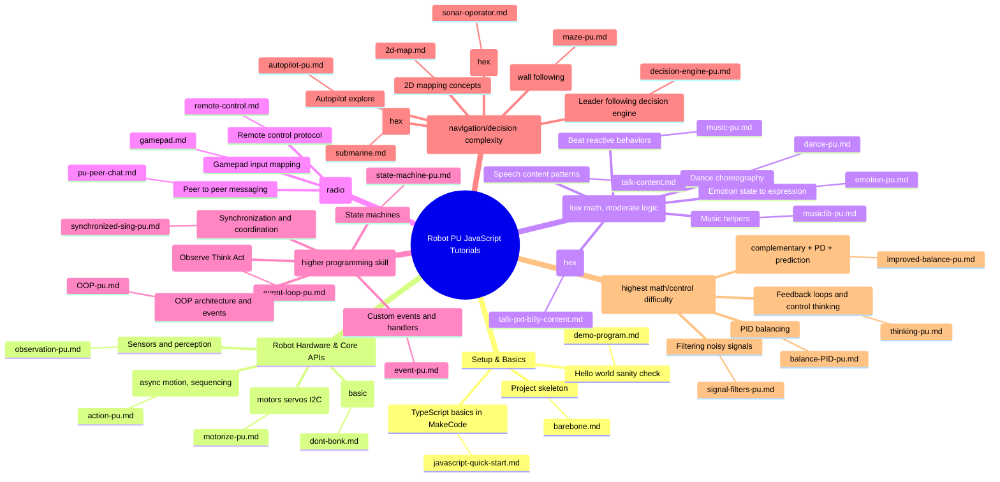

# JavaScript Tutorials (Robot PU)

This folder contains the JavaScript / TypeScript tutorials for the **Robot PU** MakeCode extension.

These lessons are written for the **micro:bit MakeCode editor**:

- https://makecode.microbit.org

---

## How to use these tutorials

- Open the MakeCode editor.
- Add the **Robot PU** extension.
- Follow a tutorial below (most lessons include copy/pasteable `typescript` code snippets).
- If a tutorial provides a compiled `.hex` file, you can download it directly and flash it to the micro:bit.

---
## Knowledge graph

## Content index

Follow this sequence from beginner to advanced. Each step assumes you’re comfortable with the previous ones.

### Learning path (beginner → advanced)

- **Bare minimum project structure**
  - `barebone.md`

- **A small demo program to verify your setup**
  - `demo-program.md`

- **JavaScript / TypeScript quick start**
  - `javascript-quick-start.md`

- **Submarine sonar (complete project)**
  - `submarine.md`
  - `.hex` included: `microbit-robot-pu-submarine-sonar.hex`

- **Don’t bonk (basic obstacle avoidance patterns)**
  - `dont-bonk.md`

- **Sonar operator (operator UI + control patterns)**
  - `sonar-operator.md`
  - `.hex` included: `microbit-robot-pu-sonar-operator.hex`

- **Talk (pxt-billy content)**
  - `talk-pxt-billy-content.md`
  - `.hex` included: `microbit-robot-pu-pxt-billy-content.hex`

- **Talk content (speech/script content patterns)**
  - `talk-content.md`

- **How Robot PU moves (motorization + I2C + servos)**
  - `motorize-pu.md`

- **Robot actions (sequencing + asynchronous motion APIs)**
  - `action-pu.md`

- **Robot observation (sensors / perception)**
  - `observation-pu.md`

- **Music + beat-driven behaviors**
  - `music-pu.md`

- **Synchronized singing (timing + coordination across robots)**
  - `synchronized-sing-pu.md`

- **Music library utilities (notes, tempo helpers, etc.)**
  - `musiclib-pu.md`

- **Remote control (radio gamepad / message protocol)**
  - `remote-control.md`

- **Gamepad patterns (controller mappings and input handling)**
  - `gamepad.md`

- **Peer chat over radio (message patterns)**
  - `pu-peer-chat.md`

- **Event loop: Observation → Thinking → Action (robot multitasking)**
  - `event-loop-pu.md`

- **Custom events + event handlers (MakeCode event system patterns)**
  - `event-pu.md`

- **State machines (structured robot behavior)**
  - `state-machine-pu.md`

- **Dance: from built-in `dance()` to beat-synced choreography**
  - `dance-pu.md`

- **Emotions: eyes + blinking + body language (signals → emotion → expression)**
  - `emotion-pu.md`

- **Signal filters (clean noisy sonar / sensor signals)**
  - `signal-filters-pu.md`

- **Maze solving (right-hand / left-hand wall following)**
  - `maze-pu.md`

- **Autopilot navigation (sonar explore behaviors)**
  - `autopilot-pu.md`

- **Leader-following decision engine (follow leader while avoiding obstacles)**
  - `decision-engine-pu.md`

- **2D mapping concepts (occupancy grid + local mapping)**
  - `2d-map.md`

- **Robot thinking (feedback loops / control)**
  - `thinking-pu.md`

- **Balancing (PID-based discussion and examples)**
  - `balance-PID-pu.md`

- **Improved balancing (noise + delay, complementary filter + PD + prediction)**
  - `improved-balance-pu.md`

- **OOP + event handlers (clean, modular robot software design)**
  - `OOP-pu.md`

---

## Folder contents (quick reference)

- Tutorials: `*.md`
- Compiled examples: `*.hex`
