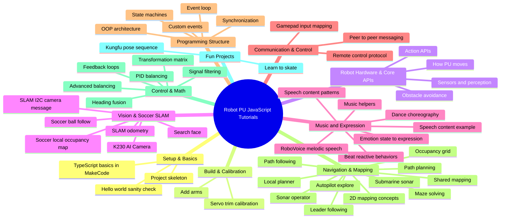
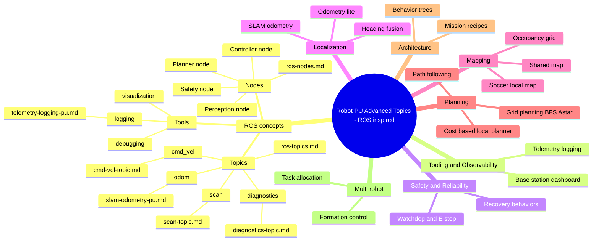

# JavaScript Tutorials (Robot PU)

This folder contains the JavaScript / TypeScript tutorials for the **Robot PU** MakeCode extension.

These lessons are written for the **micro:bit MakeCode editor**:

- **MakeCode editor**: https://makecode.microbit.org
- **GitHub tutorial folder**: https://github.com/robotgyms/pxt-robotpu/tree/main/tutorials

---

## How to use these tutorials

- **Open MakeCode**: Go to https://makecode.microbit.org.
- **Add Robot PU**: Add the **Robot PU** extension to your MakeCode project.
- **Choose a tutorial**: Click a tutorial link below and copy the TypeScript code into MakeCode when provided.
- **Flash examples**: If a tutorial mentions a `.hex` file, download and flash it to the micro:bit.

---

## Knowledge graph

---

## Advanced ROS topics knowledge graph

---

## Pick projects by age

Teachers can cherry-pick from the pool using these age/grade bands. The level is set by the **most complex program in the tutorial**, not by the topic name.

| Age | Grade | Difficulty | What the hardest program usually involves |
|-----|-------|------------|-------------------------------------------|
| 8-10 | 3-5 | Beginner | Single loops, simple sequences, no concurrency, no sensor fusion |
| 11-13 | 6-8 | Intermediate | Concurrent loops, arrays, events, radio, basic autonomy, or multi-servo coordination |
| 14-17 | 9-12 | Advanced | SLAM, camera parsing, mapping, path planning, control theory, ROS-style architecture, or machine learning |

### Ages 8-10 (Grades 3-5)

- **Project skeleton**: [barebone.md](https://github.com/robotgyms/pxt-robotpu/blob/main/tutorials/barebone.md)
- **Hello world demo**: [demo-program.md](https://github.com/robotgyms/pxt-robotpu/blob/main/tutorials/demo-program.md)
- **Add arms**: [AddArms.md](https://github.com/robotgyms/pxt-robotpu/blob/main/tutorials/AddArms.md)
- **Servo trim calibration**: [servo-trim-calibration.md](https://github.com/robotgyms/pxt-robotpu/blob/main/tutorials/servo-trim-calibration.md)
- **How PU moves**: [motorize-pu.md](https://github.com/robotgyms/pxt-robotpu/blob/main/tutorials/motorize-pu.md)
- **Robot actions**: [action-pu.md](https://github.com/robotgyms/pxt-robotpu/blob/main/tutorials/action-pu.md)
- **Dance choreography**: [dance-pu.md](https://github.com/robotgyms/pxt-robotpu/blob/main/tutorials/dance-pu.md)
- **Music + beat-driven behaviors**: [music-pu.md](https://github.com/robotgyms/pxt-robotpu/blob/main/tutorials/music-pu.md)
- **Remote control**: [remote-control.md](https://github.com/robotgyms/pxt-robotpu/blob/main/tutorials/remote-control.md)
- **Gamepad patterns**: [gamepad.md](https://github.com/robotgyms/pxt-robotpu/blob/main/tutorials/gamepad.md)

### Ages 11-13 (Grades 6-8)

- **TypeScript basics in MakeCode**: [javascript-quick-start.md](https://github.com/robotgyms/pxt-robotpu/blob/main/tutorials/javascript-quick-start.md)
- **Robot observation**: [observation-pu.md](https://github.com/robotgyms/pxt-robotpu/blob/main/tutorials/observation-pu.md)
- **Don’t bonk**: [dont-bonk.md](https://github.com/robotgyms/pxt-robotpu/blob/main/tutorials/dont-bonk.md)
- **Event loop**: [event-loop-pu.md](https://github.com/robotgyms/pxt-robotpu/blob/main/tutorials/event-loop-pu.md)
- **Custom events and handlers**: [event-pu.md](https://github.com/robotgyms/pxt-robotpu/blob/main/tutorials/event-pu.md)
- **State machines**: [state-machine-pu.md](https://github.com/robotgyms/pxt-robotpu/blob/main/tutorials/state-machine-pu.md)
- **OOP architecture**: [OOP-pu.md](https://github.com/robotgyms/pxt-robotpu/blob/main/tutorials/OOP-pu.md)
- **ROS nodes as roles**: [ros-nodes.md](https://github.com/robotgyms/pxt-robotpu/blob/main/tutorials/ros-nodes.md)
- **ROS topics**: [ros-topics.md](https://github.com/robotgyms/pxt-robotpu/blob/main/tutorials/ros-topics.md)
- **ROS /cmd_vel topic**: [cmd-vel-topic.md](https://github.com/robotgyms/pxt-robotpu/blob/main/tutorials/cmd-vel-topic.md)
- **ROS /scan topic**: [scan-topic.md](https://github.com/robotgyms/pxt-robotpu/blob/main/tutorials/scan-topic.md)
- **ROS /diagnostics topic**: [diagnostics-topic.md](https://github.com/robotgyms/pxt-robotpu/blob/main/tutorials/diagnostics-topic.md)
- **Kungfu pose sequence**: [kungfu.md](https://github.com/robotgyms/pxt-robotpu/blob/main/tutorials/kungfu.md)
- **Peer chat over radio**: [pu-peer-chat.md](https://github.com/robotgyms/pxt-robotpu/blob/main/tutorials/pu-peer-chat.md)
- **Sonar operator**: [sonar-operator.md](https://github.com/robotgyms/pxt-robotpu/blob/main/tutorials/sonar-operator.md)
- **Maze solving**: [maze-pu.md](https://github.com/robotgyms/pxt-robotpu/blob/main/tutorials/maze-pu.md)
- **Autopilot navigation**: [autopilot-pu.md](https://github.com/robotgyms/pxt-robotpu/blob/main/tutorials/autopilot-pu.md)
- **2D mapping concepts**: [2d-map.md](https://github.com/robotgyms/pxt-robotpu/blob/main/tutorials/2d-map.md)
- **Emotion state to expression**: [emotion-pu.md](https://github.com/robotgyms/pxt-robotpu/blob/main/tutorials/emotion-pu.md)
- **RoboVoice melodic speech**: [robotvoice.md](https://github.com/robotgyms/pxt-robotpu/blob/main/tutorials/robotvoice.md)
- **Music library utilities**: [musiclib-pu.md](https://github.com/robotgyms/pxt-robotpu/blob/main/tutorials/musiclib-pu.md)
- **Synchronized singing**: [synchronized-sing-pu.md](https://github.com/robotgyms/pxt-robotpu/blob/main/tutorials/synchronized-sing-pu.md)
- **Talk content patterns**: [talk-content.md](https://github.com/robotgyms/pxt-robotpu/blob/main/tutorials/talk-content.md)
- **Talk pxt-billy content**: [talk-pxt-billy-content.md](https://github.com/robotgyms/pxt-robotpu/blob/main/tutorials/talk-pxt-billy-content.md)

### Ages 14-17 (Grades 9-12)

- **K230 AI camera**: [K230-AI-Camera-pu.md](https://github.com/robotgyms/pxt-robotpu/blob/main/tutorials/K230-AI-Camera-pu.md)
- **Search face**: [search-face.md](https://github.com/robotgyms/pxt-robotpu/blob/main/tutorials/search-face.md)
- **SLAM I2C camera message**: [slam-i2c-cam.md](https://github.com/robotgyms/pxt-robotpu/blob/main/tutorials/slam-i2c-cam.md)
- **SLAM odometry**: [slam-odometry-pu.md](https://github.com/robotgyms/pxt-robotpu/blob/main/tutorials/slam-odometry-pu.md)
- **SLAM soccer ball follow**: [slam-soccer-ball-follow.md](https://github.com/robotgyms/pxt-robotpu/blob/main/tutorials/slam-soccer-ball-follow.md)
- **SLAM soccer local occupancy map**: [slam-soccer-local-map.md](https://github.com/robotgyms/pxt-robotpu/blob/main/tutorials/slam-soccer-local-map.md)
- **Submarine sonar**: [submarine.md](https://github.com/robotgyms/pxt-robotpu/blob/main/tutorials/submarine.md)
- **Occupancy grid**: [occupancy-grid-pu.md](https://github.com/robotgyms/pxt-robotpu/blob/main/tutorials/occupancy-grid-pu.md)
- **Shared mapping**: [shared-map-pu.md](https://github.com/robotgyms/pxt-robotpu/blob/main/tutorials/shared-map-pu.md)
- **Path planning**: [path-planning-pu.md](https://github.com/robotgyms/pxt-robotpu/blob/main/tutorials/path-planning-pu.md)
- **Path following**: [path-following-pu.md](https://github.com/robotgyms/pxt-robotpu/blob/main/tutorials/path-following-pu.md)
- **Local planner**: [local-planner-pu.md](https://github.com/robotgyms/pxt-robotpu/blob/main/tutorials/local-planner-pu.md)
- **Leader-following decision engine**: [decision-engine-pu.md](https://github.com/robotgyms/pxt-robotpu/blob/main/tutorials/decision-engine-pu.md)
- **Transformation matrix**: [transformation-matrix.md](https://github.com/robotgyms/pxt-robotpu/blob/main/tutorials/transformation-matrix.md)
- **Robot thinking and feedback loops**: [thinking-pu.md](https://github.com/robotgyms/pxt-robotpu/blob/main/tutorials/thinking-pu.md)
- **Signal filters**: [signal-filters-pu.md](https://github.com/robotgyms/pxt-robotpu/blob/main/tutorials/signal-filters-pu.md)
- **Heading fusion**: [heading-fusion-pu.md](https://github.com/robotgyms/pxt-robotpu/blob/main/tutorials/heading-fusion-pu.md)
- **PID balancing**: [balance-PID-pu.md](https://github.com/robotgyms/pxt-robotpu/blob/main/tutorials/balance-PID-pu.md)
- **Improved balancing**: [improved-balance-pu.md](https://github.com/robotgyms/pxt-robotpu/blob/main/tutorials/improved-balance-pu.md)
- **Learn to skate**: [learn-skate.md](https://github.com/robotgyms/pxt-robotpu/blob/main/tutorials/learn-skate.md)
- **Telemetry logging**: [telemetry-logging-pu.md](https://github.com/robotgyms/pxt-robotpu/blob/main/tutorials/telemetry-logging-pu.md)
- **Base station dashboard**: [base-station-dashboard-pu.md](https://github.com/robotgyms/pxt-robotpu/blob/main/tutorials/base-station-dashboard-pu.md)
- **Safety watchdog + E-stop**: [safety-watchdog-pu.md](https://github.com/robotgyms/pxt-robotpu/blob/main/tutorials/safety-watchdog-pu.md)
- **Fault recovery behaviors**: [fault-recovery-pu.md](https://github.com/robotgyms/pxt-robotpu/blob/main/tutorials/fault-recovery-pu.md)
- **Behavior trees**: [behavior-tree-pu.md](https://github.com/robotgyms/pxt-robotpu/blob/main/tutorials/behavior-tree-pu.md)
- **Mission recipes**: [missions-pu.md](https://github.com/robotgyms/pxt-robotpu/blob/main/tutorials/missions-pu.md)
- **Task allocation**: [task-allocation-pu.md](https://github.com/robotgyms/pxt-robotpu/blob/main/tutorials/task-allocation-pu.md)
- **Formation control**: [formation-control-pu.md](https://github.com/robotgyms/pxt-robotpu/blob/main/tutorials/formation-control-pu.md)

---

## Content index

Follow this sequence from beginner to advanced. Each tutorial link points to the GitHub file so students can click directly into the lesson.

Difficulty legend: ⭐ = Beginner (8-10), ⭐⭐ = Intermediate (11-13), ⭐⭐⭐ = Advanced (14-17).

### Setup & basics

- **Bare minimum project structure** ⭐: [barebone.md](https://github.com/robotgyms/pxt-robotpu/blob/main/tutorials/barebone.md)
- **A small demo program to verify your setup** ⭐: [demo-program.md](https://github.com/robotgyms/pxt-robotpu/blob/main/tutorials/demo-program.md)
- **JavaScript / TypeScript quick start** ⭐⭐: [javascript-quick-start.md](https://github.com/robotgyms/pxt-robotpu/blob/main/tutorials/javascript-quick-start.md)

### Build, assembly, and calibration

- **Add arms** ⭐: [AddArms.md](https://github.com/robotgyms/pxt-robotpu/blob/main/tutorials/AddArms.md)
- **Servo trim calibration** ⭐: [servo-trim-calibration.md](https://github.com/robotgyms/pxt-robotpu/blob/main/tutorials/servo-trim-calibration.md)

### Robot hardware & core APIs

- **How Robot PU moves** ⭐: [motorize-pu.md](https://github.com/robotgyms/pxt-robotpu/blob/main/tutorials/motorize-pu.md)
- **Robot actions** ⭐: [action-pu.md](https://github.com/robotgyms/pxt-robotpu/blob/main/tutorials/action-pu.md)
- **Robot observation** ⭐⭐: [observation-pu.md](https://github.com/robotgyms/pxt-robotpu/blob/main/tutorials/observation-pu.md)
- **Don’t bonk** ⭐⭐: [dont-bonk.md](https://github.com/robotgyms/pxt-robotpu/blob/main/tutorials/dont-bonk.md)

### Vision, AI camera, and soccer SLAM

- **K230 AI camera** ⭐⭐⭐: [K230-AI-Camera-pu.md](https://github.com/robotgyms/pxt-robotpu/blob/main/tutorials/K230-AI-Camera-pu.md)
- **Search face** ⭐⭐⭐: [search-face.md](https://github.com/robotgyms/pxt-robotpu/blob/main/tutorials/search-face.md)
- **SLAM I2C camera message** ⭐⭐⭐: [slam-i2c-cam.md](https://github.com/robotgyms/pxt-robotpu/blob/main/tutorials/slam-i2c-cam.md)
- **SLAM odometry** ⭐⭐⭐: [slam-odometry-pu.md](https://github.com/robotgyms/pxt-robotpu/blob/main/tutorials/slam-odometry-pu.md)
- **SLAM soccer ball follow** ⭐⭐⭐: [slam-soccer-ball-follow.md](https://github.com/robotgyms/pxt-robotpu/blob/main/tutorials/slam-soccer-ball-follow.md)
- **SLAM soccer local occupancy map** ⭐⭐⭐: [slam-soccer-local-map.md](https://github.com/robotgyms/pxt-robotpu/blob/main/tutorials/slam-soccer-local-map.md)

### Music, speech, and expression

- **Music + beat-driven behaviors** ⭐: [music-pu.md](https://github.com/robotgyms/pxt-robotpu/blob/main/tutorials/music-pu.md)
- **Music library utilities** ⭐⭐: [musiclib-pu.md](https://github.com/robotgyms/pxt-robotpu/blob/main/tutorials/musiclib-pu.md)
- **Dance choreography** ⭐: [dance-pu.md](https://github.com/robotgyms/pxt-robotpu/blob/main/tutorials/dance-pu.md)
- **Emotion state to expression** ⭐⭐: [emotion-pu.md](https://github.com/robotgyms/pxt-robotpu/blob/main/tutorials/emotion-pu.md)
- **RoboVoice melodic speech** ⭐⭐: [robotvoice.md](https://github.com/robotgyms/pxt-robotpu/blob/main/tutorials/robotvoice.md)
- **Talk content patterns** ⭐⭐: [talk-content.md](https://github.com/robotgyms/pxt-robotpu/blob/main/tutorials/talk-content.md)
- **Talk pxt-billy content** ⭐⭐: [talk-pxt-billy-content.md](https://github.com/robotgyms/pxt-robotpu/blob/main/tutorials/talk-pxt-billy-content.md)

### Fun projects

- **Kungfu pose sequence** ⭐⭐: [kungfu.md](https://github.com/robotgyms/pxt-robotpu/blob/main/tutorials/kungfu.md)
- **Learn to skate** ⭐⭐⭐: [learn-skate.md](https://github.com/robotgyms/pxt-robotpu/blob/main/tutorials/learn-skate.md)

### Communication & control

- **Remote control** ⭐: [remote-control.md](https://github.com/robotgyms/pxt-robotpu/blob/main/tutorials/remote-control.md)
- **Gamepad patterns** ⭐: [gamepad.md](https://github.com/robotgyms/pxt-robotpu/blob/main/tutorials/gamepad.md)
- **Peer chat over radio** ⭐⭐: [pu-peer-chat.md](https://github.com/robotgyms/pxt-robotpu/blob/main/tutorials/pu-peer-chat.md)

### Programming structure

- **Event loop** ⭐⭐: [event-loop-pu.md](https://github.com/robotgyms/pxt-robotpu/blob/main/tutorials/event-loop-pu.md)
- **Custom events and handlers** ⭐⭐: [event-pu.md](https://github.com/robotgyms/pxt-robotpu/blob/main/tutorials/event-pu.md)
- **State machines** ⭐⭐: [state-machine-pu.md](https://github.com/robotgyms/pxt-robotpu/blob/main/tutorials/state-machine-pu.md)
- **Object-oriented programming architecture** ⭐⭐: [OOP-pu.md](https://github.com/robotgyms/pxt-robotpu/blob/main/tutorials/OOP-pu.md)
- **Synchronized singing** ⭐⭐: [synchronized-sing-pu.md](https://github.com/robotgyms/pxt-robotpu/blob/main/tutorials/synchronized-sing-pu.md)

### Navigation, autonomy, and mapping

- **Submarine sonar complete project** ⭐⭐⭐: [submarine.md](https://github.com/robotgyms/pxt-robotpu/blob/main/tutorials/submarine.md)
- **Sonar operator** ⭐⭐: [sonar-operator.md](https://github.com/robotgyms/pxt-robotpu/blob/main/tutorials/sonar-operator.md)
- **Maze solving** ⭐⭐: [maze-pu.md](https://github.com/robotgyms/pxt-robotpu/blob/main/tutorials/maze-pu.md)
- **Autopilot navigation** ⭐⭐: [autopilot-pu.md](https://github.com/robotgyms/pxt-robotpu/blob/main/tutorials/autopilot-pu.md)
- **Leader-following decision engine** ⭐⭐⭐: [decision-engine-pu.md](https://github.com/robotgyms/pxt-robotpu/blob/main/tutorials/decision-engine-pu.md)
- **2D mapping concepts** ⭐⭐: [2d-map.md](https://github.com/robotgyms/pxt-robotpu/blob/main/tutorials/2d-map.md)
- **Occupancy grid** ⭐⭐⭐: [occupancy-grid-pu.md](https://github.com/robotgyms/pxt-robotpu/blob/main/tutorials/occupancy-grid-pu.md)
- **Shared mapping** ⭐⭐⭐: [shared-map-pu.md](https://github.com/robotgyms/pxt-robotpu/blob/main/tutorials/shared-map-pu.md)
- **Path planning** ⭐⭐⭐: [path-planning-pu.md](https://github.com/robotgyms/pxt-robotpu/blob/main/tutorials/path-planning-pu.md)
- **Path following** ⭐⭐⭐: [path-following-pu.md](https://github.com/robotgyms/pxt-robotpu/blob/main/tutorials/path-following-pu.md)
- **Local planner** ⭐⭐⭐: [local-planner-pu.md](https://github.com/robotgyms/pxt-robotpu/blob/main/tutorials/local-planner-pu.md)

### ROS concepts

- **ROS nodes as roles** ⭐⭐: [ros-nodes.md](https://github.com/robotgyms/pxt-robotpu/blob/main/tutorials/ros-nodes.md)
- **ROS topics on micro:bit** ⭐⭐: [ros-topics.md](https://github.com/robotgyms/pxt-robotpu/blob/main/tutorials/ros-topics.md)
- **ROS /cmd_vel topic** ⭐⭐: [cmd-vel-topic.md](https://github.com/robotgyms/pxt-robotpu/blob/main/tutorials/cmd-vel-topic.md)
- **ROS /scan topic** ⭐⭐: [scan-topic.md](https://github.com/robotgyms/pxt-robotpu/blob/main/tutorials/scan-topic.md)
- **ROS /diagnostics topic** ⭐⭐: [diagnostics-topic.md](https://github.com/robotgyms/pxt-robotpu/blob/main/tutorials/diagnostics-topic.md)

### ROS-inspired robotics architecture

- **Telemetry logging** ⭐⭐⭐: [telemetry-logging-pu.md](https://github.com/robotgyms/pxt-robotpu/blob/main/tutorials/telemetry-logging-pu.md)
- **Base station dashboard** ⭐⭐⭐: [base-station-dashboard-pu.md](https://github.com/robotgyms/pxt-robotpu/blob/main/tutorials/base-station-dashboard-pu.md)
- **Safety watchdog + E-stop** ⭐⭐⭐: [safety-watchdog-pu.md](https://github.com/robotgyms/pxt-robotpu/blob/main/tutorials/safety-watchdog-pu.md)
- **Fault recovery behaviors** ⭐⭐⭐: [fault-recovery-pu.md](https://github.com/robotgyms/pxt-robotpu/blob/main/tutorials/fault-recovery-pu.md)
- **Behavior trees** ⭐⭐⭐: [behavior-tree-pu.md](https://github.com/robotgyms/pxt-robotpu/blob/main/tutorials/behavior-tree-pu.md)
- **Mission recipes** ⭐⭐⭐: [missions-pu.md](https://github.com/robotgyms/pxt-robotpu/blob/main/tutorials/missions-pu.md)
- **Task allocation** ⭐⭐⭐: [task-allocation-pu.md](https://github.com/robotgyms/pxt-robotpu/blob/main/tutorials/task-allocation-pu.md)
- **Formation control** ⭐⭐⭐: [formation-control-pu.md](https://github.com/robotgyms/pxt-robotpu/blob/main/tutorials/formation-control-pu.md)

### Control & math

- **Transformation matrix** ⭐⭐⭐: [transformation-matrix.md](https://github.com/robotgyms/pxt-robotpu/blob/main/tutorials/transformation-matrix.md)
- **Robot thinking and feedback loops** ⭐⭐⭐: [thinking-pu.md](https://github.com/robotgyms/pxt-robotpu/blob/main/tutorials/thinking-pu.md)
- **Signal filters** ⭐⭐⭐: [signal-filters-pu.md](https://github.com/robotgyms/pxt-robotpu/blob/main/tutorials/signal-filters-pu.md)
- **Heading fusion** ⭐⭐⭐: [heading-fusion-pu.md](https://github.com/robotgyms/pxt-robotpu/blob/main/tutorials/heading-fusion-pu.md)
- **PID balancing** ⭐⭐⭐: [balance-PID-pu.md](https://github.com/robotgyms/pxt-robotpu/blob/main/tutorials/balance-PID-pu.md)
- **Improved balancing** ⭐⭐⭐: [improved-balance-pu.md](https://github.com/robotgyms/pxt-robotpu/blob/main/tutorials/improved-balance-pu.md)

---

## Complete markdown file checklist

Every `.md` file in this folder is listed below with a GitHub URL.

- **2d-map.md**: https://github.com/robotgyms/pxt-robotpu/blob/main/tutorials/2d-map.md
- **AddArms.md**: https://github.com/robotgyms/pxt-robotpu/blob/main/tutorials/AddArms.md
- **K230-AI-Camera-pu.md**: https://github.com/robotgyms/pxt-robotpu/blob/main/tutorials/K230-AI-Camera-pu.md
- **OOP-pu.md**: https://github.com/robotgyms/pxt-robotpu/blob/main/tutorials/OOP-pu.md
- **README.md**: https://github.com/robotgyms/pxt-robotpu/blob/main/tutorials/README.md
- **action-pu.md**: https://github.com/robotgyms/pxt-robotpu/blob/main/tutorials/action-pu.md
- **autopilot-pu.md**: https://github.com/robotgyms/pxt-robotpu/blob/main/tutorials/autopilot-pu.md
- **balance-PID-pu.md**: https://github.com/robotgyms/pxt-robotpu/blob/main/tutorials/balance-PID-pu.md
- **barebone.md**: https://github.com/robotgyms/pxt-robotpu/blob/main/tutorials/barebone.md
- **base-station-dashboard-pu.md**: https://github.com/robotgyms/pxt-robotpu/blob/main/tutorials/base-station-dashboard-pu.md
- **behavior-tree-pu.md**: https://github.com/robotgyms/pxt-robotpu/blob/main/tutorials/behavior-tree-pu.md
- **cmd-vel-topic.md**: https://github.com/robotgyms/pxt-robotpu/blob/main/tutorials/cmd-vel-topic.md
- **dance-pu.md**: https://github.com/robotgyms/pxt-robotpu/blob/main/tutorials/dance-pu.md
- **decision-engine-pu.md**: https://github.com/robotgyms/pxt-robotpu/blob/main/tutorials/decision-engine-pu.md
- **demo-program.md**: https://github.com/robotgyms/pxt-robotpu/blob/main/tutorials/demo-program.md
- **diagnostics-topic.md**: https://github.com/robotgyms/pxt-robotpu/blob/main/tutorials/diagnostics-topic.md
- **dont-bonk.md**: https://github.com/robotgyms/pxt-robotpu/blob/main/tutorials/dont-bonk.md
- **emotion-pu.md**: https://github.com/robotgyms/pxt-robotpu/blob/main/tutorials/emotion-pu.md
- **event-loop-pu.md**: https://github.com/robotgyms/pxt-robotpu/blob/main/tutorials/event-loop-pu.md
- **event-pu.md**: https://github.com/robotgyms/pxt-robotpu/blob/main/tutorials/event-pu.md
- **fault-recovery-pu.md**: https://github.com/robotgyms/pxt-robotpu/blob/main/tutorials/fault-recovery-pu.md
- **formation-control-pu.md**: https://github.com/robotgyms/pxt-robotpu/blob/main/tutorials/formation-control-pu.md
- **gamepad.md**: https://github.com/robotgyms/pxt-robotpu/blob/main/tutorials/gamepad.md
- **heading-fusion-pu.md**: https://github.com/robotgyms/pxt-robotpu/blob/main/tutorials/heading-fusion-pu.md
- **improved-balance-pu.md**: https://github.com/robotgyms/pxt-robotpu/blob/main/tutorials/improved-balance-pu.md
- **javascript-quick-start.md**: https://github.com/robotgyms/pxt-robotpu/blob/main/tutorials/javascript-quick-start.md
- **kungfu.md**: https://github.com/robotgyms/pxt-robotpu/blob/main/tutorials/kungfu.md
- **learn-skate.md**: https://github.com/robotgyms/pxt-robotpu/blob/main/tutorials/learn-skate.md
- **local-planner-pu.md**: https://github.com/robotgyms/pxt-robotpu/blob/main/tutorials/local-planner-pu.md
- **maze-pu.md**: https://github.com/robotgyms/pxt-robotpu/blob/main/tutorials/maze-pu.md
- **missions-pu.md**: https://github.com/robotgyms/pxt-robotpu/blob/main/tutorials/missions-pu.md
- **motorize-pu.md**: https://github.com/robotgyms/pxt-robotpu/blob/main/tutorials/motorize-pu.md
- **music-pu.md**: https://github.com/robotgyms/pxt-robotpu/blob/main/tutorials/music-pu.md
- **musiclib-pu.md**: https://github.com/robotgyms/pxt-robotpu/blob/main/tutorials/musiclib-pu.md
- **observation-pu.md**: https://github.com/robotgyms/pxt-robotpu/blob/main/tutorials/observation-pu.md
- **occupancy-grid-pu.md**: https://github.com/robotgyms/pxt-robotpu/blob/main/tutorials/occupancy-grid-pu.md
- **path-following-pu.md**: https://github.com/robotgyms/pxt-robotpu/blob/main/tutorials/path-following-pu.md
- **path-planning-pu.md**: https://github.com/robotgyms/pxt-robotpu/blob/main/tutorials/path-planning-pu.md
- **pu-peer-chat.md**: https://github.com/robotgyms/pxt-robotpu/blob/main/tutorials/pu-peer-chat.md
- **remote-control.md**: https://github.com/robotgyms/pxt-robotpu/blob/main/tutorials/remote-control.md
- **robotvoice.md**: https://github.com/robotgyms/pxt-robotpu/blob/main/tutorials/robotvoice.md
- **ros-nodes.md**: https://github.com/robotgyms/pxt-robotpu/blob/main/tutorials/ros-nodes.md
- **ros-topics.md**: https://github.com/robotgyms/pxt-robotpu/blob/main/tutorials/ros-topics.md
- **safety-watchdog-pu.md**: https://github.com/robotgyms/pxt-robotpu/blob/main/tutorials/safety-watchdog-pu.md
- **scan-topic.md**: https://github.com/robotgyms/pxt-robotpu/blob/main/tutorials/scan-topic.md
- **search-face.md**: https://github.com/robotgyms/pxt-robotpu/blob/main/tutorials/search-face.md
- **servo-trim-calibration.md**: https://github.com/robotgyms/pxt-robotpu/blob/main/tutorials/servo-trim-calibration.md
- **shared-map-pu.md**: https://github.com/robotgyms/pxt-robotpu/blob/main/tutorials/shared-map-pu.md
- **signal-filters-pu.md**: https://github.com/robotgyms/pxt-robotpu/blob/main/tutorials/signal-filters-pu.md
- **slam-i2c-cam.md**: https://github.com/robotgyms/pxt-robotpu/blob/main/tutorials/slam-i2c-cam.md
- **slam-odometry-pu.md**: https://github.com/robotgyms/pxt-robotpu/blob/main/tutorials/slam-odometry-pu.md
- **slam-soccer-ball-follow.md**: https://github.com/robotgyms/pxt-robotpu/blob/main/tutorials/slam-soccer-ball-follow.md
- **slam-soccer-local-map.md**: https://github.com/robotgyms/pxt-robotpu/blob/main/tutorials/slam-soccer-local-map.md
- **sonar-operator.md**: https://github.com/robotgyms/pxt-robotpu/blob/main/tutorials/sonar-operator.md
- **state-machine-pu.md**: https://github.com/robotgyms/pxt-robotpu/blob/main/tutorials/state-machine-pu.md
- **submarine.md**: https://github.com/robotgyms/pxt-robotpu/blob/main/tutorials/submarine.md
- **synchronized-sing-pu.md**: https://github.com/robotgyms/pxt-robotpu/blob/main/tutorials/synchronized-sing-pu.md
- **talk-content.md**: https://github.com/robotgyms/pxt-robotpu/blob/main/tutorials/talk-content.md
- **talk-pxt-billy-content.md**: https://github.com/robotgyms/pxt-robotpu/blob/main/tutorials/talk-pxt-billy-content.md
- **task-allocation-pu.md**: https://github.com/robotgyms/pxt-robotpu/blob/main/tutorials/task-allocation-pu.md
- **telemetry-logging-pu.md**: https://github.com/robotgyms/pxt-robotpu/blob/main/tutorials/telemetry-logging-pu.md
- **thinking-pu.md**: https://github.com/robotgyms/pxt-robotpu/blob/main/tutorials/thinking-pu.md
- **transformation-matrix.md**: https://github.com/robotgyms/pxt-robotpu/blob/main/tutorials/transformation-matrix.md

---

## Folder contents quick reference

- **Markdown tutorials**: `63` `.md` files, including this `README.md`.
- **Compiled examples**: `.hex` files are included for selected complete projects.
